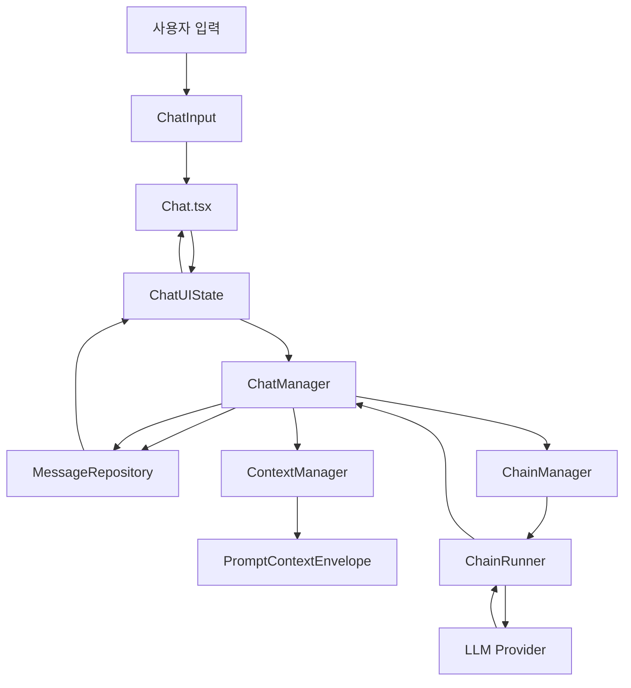

# INTRO-STRUCTURE

이 문서는 `obsidian-copilot` fork를 처음 보는 개발자가 현재 프로젝트 구조를 빠르게 이해하기 위한 안내서입니다. 단순한 디렉터리 목록이 아니라, 실제 런타임에서 어떤 객체가 어떤 순서로 연결되는지, 어디를 먼저 읽어야 하는지, 변경할 때 어떤 경계를 조심해야 하는지를 설명합니다.

## 1. 프로젝트 한눈에 보기

이 프로젝트는 Obsidian용 AI assistant 플러그인입니다. 사용자는 Obsidian 안에서 채팅, Vault 검색, 노트 읽기/쓰기, 커스텀 프롬프트, 프로젝트 기반 컨텍스트, 여러 LLM provider, autocomplete, Quick Ask 등을 사용할 수 있습니다.

기술적으로는 다음 계층이 조합되어 있습니다.

| 계층                         | 주요 역할                                                               | 대표 파일/디렉터리                                                         |
| ---------------------------- | ----------------------------------------------------------------------- | -------------------------------------------------------------------------- |
| Obsidian 플러그인 부트스트랩 | 플러그인 로딩, 설정, 뷰/명령 등록, 매니저 초기화                        | `src/main.ts`                                                              |
| React UI                     | 채팅 화면, 입력창, 설정 UI, 모달, Quick Ask                             | `src/components/`                                                          |
| UI 상태                      | React와 비즈니스 로직 사이의 얇은 상태 계층                             | `src/state/ChatUIState.ts`, `src/aiParams.ts`                              |
| 메시지/채팅 코어             | 메시지 저장, 편집, 삭제, 재생성, 저장/불러오기                          | `src/core/`                                                                |
| 컨텍스트 엔진                | 노트, URL, 선택 텍스트, 프로젝트 컨텍스트를 LLM 입력으로 변환           | `src/context/`, `src/core/ContextManager.ts`                               |
| LLM 체인                     | provider 생성, chain runner 선택, streaming 응답 처리                   | `src/LLMProviders/`                                                        |
| 검색/RAG                     | Vault 검색, semantic index, lexical search, retriever 조합              | `src/search/`, `src/tools/SearchTools.ts`                                  |
| 도구/Agent                   | localSearch, webSearch, note tools, file tree, memory, autonomous agent | `src/tools/`, `src/LLMProviders/chainRunner/AutonomousAgentChainRunner.ts` |
| 프로젝트 모드                | 프로젝트 단위 채팅 격리, 프로젝트 컨텍스트 캐시, 파일 파싱              | `src/LLMProviders/projectManager.ts`, `src/cache/`, `src/parser/`          |
| 설정/영속화                  | Jotai 설정 상태, migration, 암호화 key 저장, chat history               | `src/settings/`, `src/core/ChatPersistenceManager.ts`                      |

가장 중요한 큰 흐름은 다음과 같습니다.

```text
Obsidian Plugin
  -> main.ts
  -> managers 초기화
  -> CopilotView React mount
  -> Chat / ChatInput
  -> ChatUIState
  -> ChatManager
  -> MessageRepository + ContextManager
  -> ChainManager
  -> ChainRunner
  -> LLM Provider
  -> streaming response
  -> MessageRepository 업데이트
  -> React UI 재렌더링
```

## 2. 런타임 진입점

### 2.1 `src/main.ts`

`src/main.ts`는 Obsidian `Plugin`을 상속하는 메인 진입점입니다. 이 파일을 읽으면 플러그인이 어떤 매니저와 기능을 조립하는지 한 번에 볼 수 있습니다.

주요 책임은 다음과 같습니다.

- 설정 로드와 저장 구독을 초기화합니다.
- API key 등 민감 설정을 암호화 저장소와 동기화합니다.
- `CopilotSettingTab`을 등록합니다.
- `ToolRegistry`와 built-in tools를 초기화합니다.
- Plus, self-hosted, Brevilabs, GitHub Copilot 관련 서비스를 준비합니다.
- `ProjectManager`, `VectorStoreManager`, `VaultDataManager`, `FileParserManager`를 생성합니다.
- `MessageRepository`, `ChatManager`, `ChatUIState`를 생성합니다.
- Obsidian view, ribbon icon, command, context menu, editor extension을 등록합니다.
- chat history loading, active note tracking, selection highlight, web selection 기능을 연결합니다.

`main.ts`는 비즈니스 로직을 직접 많이 수행하기보다는 여러 하위 manager를 조립하는 composition root에 가깝습니다. 새 기능을 추가할 때는 여기에서 전역 생명주기 등록이 필요한지 먼저 판단해야 합니다.

### 2.2 루트 설정 파일

| 파일                 | 의미                                |
| -------------------- | ----------------------------------- |
| `manifest.json`      | Obsidian 플러그인 metadata          |
| `package.json`       | npm script, dependency, version     |
| `esbuild.config.mjs` | 플러그인 번들 설정                  |
| `tailwind.config.js` | Tailwind 설정                       |
| `jest.config.js`     | Jest 테스트 설정                    |
| `tsconfig.json`      | TypeScript strict 설정과 path alias |

개발 중에는 `npm run dev`를 실행하지 않습니다. 빌드는 사용자가 직접 처리합니다. PR 전에는 `npm run format && npm run lint`가 기준입니다.

## 3. 가장 먼저 이해해야 할 정신 모델

이 프로젝트의 핵심은 "채팅 메시지 하나가 UI 표시용 텍스트와 LLM 처리용 컨텍스트를 함께 가진다"는 점입니다. 예전처럼 화면용 배열과 LLM용 배열을 따로 맞추는 구조가 아니라, `MessageRepository`가 단일 출처입니다.



변경 작업을 할 때는 지금 만지는 코드가 어느 계층인지 먼저 구분하는 것이 중요합니다.

- UI 표시만 바꾸는 작업이면 `src/components/`와 `ChatUIState` 주변을 봅니다.
- 메시지의 의미, 편집, 삭제, 재생성, 저장을 바꾸면 `src/core/`를 봅니다.
- LLM에 들어가는 실제 프롬프트 payload를 바꾸면 `src/context/`, `ContextManager`, chain runner를 봅니다.
- Vault 검색 결과나 검색 품질을 바꾸면 `src/search/`와 `src/tools/SearchTools.ts`를 봅니다.
- 프로젝트 모드 동작을 바꾸면 `ProjectManager`, `ProjectChainRunner`, cache/parser 계층을 함께 봐야 합니다.

## 4. 메시지 관리 아키텍처

### 4.1 `MessageRepository`

파일: `src/core/MessageRepository.ts`

`MessageRepository`는 채팅 메시지의 single source of truth입니다. 각 메시지는 `StoredMessage` 형태로 한 번만 저장됩니다.

핵심 개념은 다음과 같습니다.

- `displayText`: UI에 보여줄 텍스트입니다.
- `processedText`: LLM에 넘길 처리된 텍스트입니다. 현재 구조에서는 context envelope 중심으로 이동 중인 과도기 필드입니다.
- `contextEnvelope`: L1-L5 계층형 컨텍스트 엔벨로프입니다.
- `context`: note, URL, folder, selected text 등 참조 정보입니다.
- `metadata`: model, timestamp, sources, tool call 등 부가 정보입니다.

Repository는 저장된 메시지에서 용도별 view를 계산합니다.

- `getDisplayMessages()`: React UI 표시용 메시지 배열을 반환합니다.
- `getLLMMessage()`: 특정 메시지를 LLM용 메시지로 변환합니다.
- `getLLMMessages()`: 대화 history를 LLM용 메시지 배열로 변환합니다.

따라서 새 코드에서 UI용 배열과 LLM용 배열을 별도로 동기화하려는 시도는 피해야 합니다. 메시지 수정은 Repository를 거쳐야 합니다.

### 4.2 `ChatManager`

파일: `src/core/ChatManager.ts`

`ChatManager`는 채팅 도메인의 중심 coordinator입니다. React 컴포넌트가 직접 LLM 호출, context 처리, 저장소 조작을 하지 않도록 이 계층이 중간에서 조정합니다.

주요 책임은 다음과 같습니다.

- 사용자 메시지 전송
- assistant 응답 streaming 처리
- 메시지 편집, 삭제, 재생성
- chat history 저장/불러오기
- context reprocessing
- chain memory와 Repository 동기화
- project chat isolation
- active note, selected text, web tab, URL 컨텍스트 수집
- system prompt 조합과 project context 주입

프로젝트 채팅 격리는 `ChatManager` 내부의 `projectMessageRepos: Map<string, MessageRepository>`를 통해 구현됩니다. 현재 프로젝트 ID가 바뀌면 `getCurrentMessageRepo()`가 적절한 Repository를 반환합니다.

중요한 특징은 다음과 같습니다.

- 프로젝트별 메시지는 서로 섞이지 않습니다.
- 프로젝트가 아닌 일반 채팅은 기본 Repository를 사용합니다.
- 프로젝트 전환 시 현재 채팅 저장, 새 프로젝트 메시지 로드, UI 갱신이 연쇄적으로 일어납니다.
- 새 프로젝트는 빈 Repository로 시작합니다.

### 4.3 `ChatUIState`

파일: `src/state/ChatUIState.ts`

`ChatUIState`는 UI-only 상태 관리자입니다. React가 구독할 수 있는 얇은 계층이며, 비즈니스 로직은 `ChatManager`에 위임합니다.

주요 역할은 다음과 같습니다.

- 현재 표시할 messages 상태 유지
- streaming 상태와 loading 상태 전달
- React subscription 제공
- `sendMessage`, `editMessage`, `deleteMessage`, `regenerateMessage` 같은 UI action을 `ChatManager`로 전달

새 기능을 추가할 때 이 파일에 복잡한 도메인 로직을 넣으면 구조가 흐려집니다. UI에 필요한 상태 변환까지만 이 계층에 두는 것이 좋습니다.

### 4.4 `ContextManager`

파일: `src/core/ContextManager.ts`

`ContextManager`는 사용자가 보낸 한 턴의 메시지에 붙은 컨텍스트를 처리합니다.

처리 대상은 다음과 같습니다.

- `[[note]]` 참조
- `#tag` 참조
- folder 참조
- URL과 web page 내용
- selected text
- active note
- active web tab
- custom prompt template
- 이전 메시지의 context envelope

메시지를 편집하거나 재생성할 때도 context를 다시 처리합니다. 이 설계 덕분에 오래된 processed text가 계속 LLM에 들어가는 문제를 줄일 수 있습니다.

### 4.5 `ChatPersistenceManager`

파일: `src/core/ChatPersistenceManager.ts`

채팅 기록을 Markdown 파일로 저장하고 다시 읽는 계층입니다.

주요 특징은 다음과 같습니다.

- frontmatter에 model, topic, timestamp, project metadata를 저장합니다.
- 프로젝트 채팅은 파일명에 project ID prefix를 붙여 분리합니다.
- 저장된 Markdown을 다시 읽어 사용자/assistant 메시지로 파싱합니다.
- context reference는 복원하지만, 과거 메시지의 전체 envelope를 완전히 복원하는 구조는 아직 제한적입니다.

## 5. 컨텍스트 엔진과 프롬프트 payload

컨텍스트 계층은 `src/context/`와 `src/core/ContextManager.ts`가 중심입니다. 이 프로젝트는 단순히 사용자 질문 앞에 노트 내용을 붙이는 구조가 아니라, 계층형 prompt context envelope를 만듭니다.

### 5.1 L1-L5 계층

`PromptContextEnvelope`는 LLM 입력을 다음 계층으로 나눕니다.

| Layer       | 의미                                        | 예시                                              |
| ----------- | ------------------------------------------- | ------------------------------------------------- |
| L1_SYSTEM   | 전역 system 영역                            | system prompt, memory, project context            |
| L2_PREVIOUS | 이전 턴에서 이어지는 컨텍스트               | 이전 메시지의 note/web context 요약               |
| L3_TURN     | 현재 턴의 컨텍스트                          | 현재 선택한 note, URL, folder, tag, selected text |
| L4_STRIP    | memory strip 등 runner가 별도 삽입하는 영역 | memory manager 결과                               |
| L5_USER     | 실제 사용자 요청                            | 사용자가 입력한 질문 또는 명령                    |

관련 파일은 다음과 같습니다.

| 파일/디렉터리                             | 역할                               |
| ----------------------------------------- | ---------------------------------- |
| `src/context/types.ts`                    | envelope와 layer 타입              |
| `src/context/PromptContextEngine.ts`      | envelope 생성                      |
| `src/context/LayerToMessagesConverter.ts` | envelope를 LLM message 배열로 변환 |
| `src/context/ContextCompactor.ts`         | 컨텍스트 압축                      |
| `src/context/ContextSourceParser.ts`      | context source 파싱                |
| `src/context/ContextRegistry.ts`          | context item registry              |

### 5.2 변환 흐름

일반적인 메시지 처리 흐름은 다음과 같습니다.

```text
사용자 입력
  -> ContextManager.processMessageContext()
  -> custom prompt template 적용
  -> note/tag/folder/URL/selected text/web tab 처리
  -> 이전 context envelope에서 필요한 항목 승격
  -> 필요하면 context compaction
  -> PromptContextEnvelope 생성
  -> MessageRepository에 StoredMessage 저장
  -> ChainRunner가 LayerToMessagesConverter로 LLM messages 생성
```

### 5.3 주의할 점

AI prompt content, system prompt, adapter prompt는 사용자가 명시적으로 요청하지 않으면 수정하지 않습니다. 프롬프트는 동작 품질에 직접 영향을 주며, 이 프로젝트에는 system prompt file, custom command prompt, context envelope 변환이 복합적으로 얽혀 있습니다.

또한 token budget enforcement는 완전히 끝난 영역이 아닙니다. 현재 project context에는 임시 상한과 compaction이 존재하지만, 전체 layer를 아우르는 최종 token budget 정책은 기술 부채 문서에서 별도 추적됩니다.

## 6. LLM provider와 ChainRunner 구조

LLM 호출은 주로 `src/LLMProviders/` 아래에서 처리됩니다. 이름은 provider 중심이지만 실제로는 provider 생성, chain 선택, runner 실행, memory, project, agent 기능이 함께 들어 있습니다.

### 6.1 `ChainManager`

파일: `src/LLMProviders/chainManager.ts`

`ChainManager`는 LLM 실행 계층의 중심입니다.

주요 책임은 다음과 같습니다.

- 현재 chain type에 맞는 runner 선택
- model/provider 생성과 재생성
- memory manager, prompt manager, user memory manager 연결
- streaming callback 전달
- vault QA, plus, project, autonomous agent 실행 분기

`ChainManager.runChain()`을 보면 현재 사용 중인 chain type이 어떤 runner로 이동하는지 이해할 수 있습니다.

### 6.2 `ChatModelManager`

파일: `src/LLMProviders/chatModelManager.ts`

provider별 chat model을 생성합니다. 이 프로젝트는 여러 provider를 지원합니다.

- OpenAI
- Azure OpenAI
- Anthropic
- Google Gemini
- OpenRouter
- Ollama
- LM Studio
- Groq
- Mistral
- DeepSeek
- Cohere
- AWS Bedrock
- GitHub Copilot
- custom endpoint

이 계층은 provider별 API 차이를 흡수합니다. 예를 들어 temperature 지원 여부, reasoning option, token 계산 방식, CORS-safe fetch, endpoint normalization 같은 처리가 여기에서 이루어집니다.

### 6.3 ChainRunner 계층

대표 runner는 다음과 같습니다.

| Runner                       | 역할                                                                                              |
| ---------------------------- | ------------------------------------------------------------------------------------------------- |
| `LLMChainRunner`             | 일반 채팅. context envelope 기반 메시지를 LLM에 전달합니다.                                       |
| `VaultQAChainRunner`         | Vault QA. 질문을 검색 쿼리로 변환하고 retriever 결과와 citation을 사용합니다.                     |
| `CopilotPlusChainRunner`     | Plus 기능. web search, local search, composer, memory, multimodal, native tool call을 조합합니다. |
| `ProjectChainRunner`         | 프로젝트 모드. 프로젝트 컨텍스트를 L1에 주입하고 Plus 기능을 확장합니다.                          |
| `AutonomousAgentChainRunner` | autonomous agent. tool registry 기반 ReAct loop와 native tool calling을 사용합니다.               |
| `BaseChainRunner`            | 공통 streaming, 응답 처리, memory 업데이트 기반 클래스입니다.                                     |

`src/chainFactory.ts`도 존재하지만 현재 구조에서는 legacy LangChain chain factory에 가깝습니다. 새 채팅 흐름을 추가할 때는 먼저 `ChainManager`와 runner 계층을 봐야 합니다.

### 6.4 기본 응답 흐름

```text
ChatManager.getAIResponse()
  -> ChainManager.runChain()
  -> 선택된 ChainRunner.run()
  -> ChatModelManager가 만든 model 호출
  -> stream chunk 수신
  -> BaseChainRunner.handleResponse()
  -> ChatManager callback
  -> MessageRepository assistant message 업데이트
  -> ChatUIState notify
```

## 7. 검색과 RAG 구조

검색은 이 프로젝트에서 가장 넓게 퍼져 있는 영역 중 하나입니다. `@vault`, local search tool, Vault QA, project context, autonomous agent가 모두 검색 계층을 사용합니다.

### 7.1 주요 진입점

| 파일                                      | 역할                                             |
| ----------------------------------------- | ------------------------------------------------ |
| `src/tools/SearchTools.ts`                | LLM tool로 노출되는 local search/web search 구현 |
| `src/search/FilterRetriever.ts`           | title, tag, folder, time range filter를 처리     |
| `src/search/RetrieverFactory.ts`          | 현재 설정에 맞는 retriever 선택                  |
| `src/search/v3/SearchCore.ts`             | lexical search 핵심 pipeline                     |
| `src/search/v3/TieredLexicalRetriever.ts` | 최신 lexical retriever                           |
| `src/search/MergedSemanticRetriever.ts`   | lexical과 semantic 결과 병합                     |
| `src/search/vectorStoreManager.ts`        | embedding index, Orama, Miyo/self-host 검색 관리 |

### 7.2 검색 pipeline

대략적인 흐름은 다음과 같습니다.

```text
LLM 또는 UI에서 localSearch 요청
  -> SearchTools.localSearch
  -> FilterRetriever
  -> title/tag/time/folder filter 처리
  -> RetrieverFactory
  -> Miyo/self-host/semantic/lexical 중 선택
  -> SearchCore 또는 VectorStoreManager 계층
  -> 결과 정규화, citation, source 생성
  -> LLM tool result 또는 UI source로 반환
```

### 7.3 FilterRetriever의 의미

`FilterRetriever`는 단순한 wrapper가 아닙니다. 사용자가 특정 note, tag, time range를 명시한 경우 검색 의미를 보존하는 역할을 합니다.

- `[[note]]` 형태는 제목 기반 exact 또는 near match로 처리됩니다.
- `#tag` 형태는 tag filter로 처리됩니다.
- daily note나 수정 시간 범위는 time range search로 처리됩니다.
- time range 결과는 일반 retriever를 우회할 수 있습니다.

검색 품질 문제가 있을 때 바로 semantic retriever만 보면 원인을 놓칠 수 있습니다. 먼저 filter 단계에서 쿼리가 어떻게 바뀌는지 확인해야 합니다.

### 7.4 Lexical search v3

`src/search/v3/`는 lexical search를 위한 비교적 최신 구조입니다.

주요 구성은 다음과 같습니다.

- `QueryExpander`: 쿼리 확장
- `GrepScanner`: 빠른 후보 recall
- `FullTextEngine`: BM25+ 계열 full-text scoring
- folder boost, graph boost, diversity top-K
- score normalization

이 구조는 language-specific stopword나 action verb list를 하드코딩하지 않는 방향으로 설계해야 합니다.

### 7.5 VectorStoreManager는 deprecated처럼 보여도 아직 중요함

`VectorStoreManager`에는 deprecated 주석이 있지만 실제로는 여전히 다음 책임을 가집니다.

- semantic index 관리
- Orama 기반 저장소
- embedding provider 전환 처리
- indexing progress
- Miyo/self-host backend 연동
- indexed file 목록과 rebuild command 지원

따라서 이름이나 주석만 보고 삭제 가능한 legacy 코드로 판단하면 안 됩니다.

## 8. 프로젝트 모드 구조

프로젝트 모드는 일반 채팅보다 더 많은 계층이 결합됩니다. 프로젝트별 파일 범위, 컨텍스트 캐시, 프로젝트 채팅 기록, 프로젝트 전용 chain이 모두 연결됩니다.

### 8.1 `ProjectManager`

파일: `src/LLMProviders/projectManager.ts`

`ProjectManager`는 현재 프로젝트 상태를 감시하고 프로젝트 전환을 처리합니다.

주요 동작은 다음과 같습니다.

- current project atom 변경 감지
- 기존 프로젝트 채팅 저장
- 새 프로젝트 ID로 `ChatManager` repository 전환
- 프로젝트 chain/model 준비
- 프로젝트 컨텍스트 로드 또는 재생성
- project loading state 업데이트
- UI refresh 트리거

프로젝트 전환 버그는 대개 `ProjectManager`, `ChatManager.getCurrentMessageRepo()`, `ChatPersistenceManager`, `ProjectContextCache` 중 하나에서 발생합니다.

### 8.2 프로젝트 컨텍스트 캐시

| 파일/디렉터리                      | 역할                                      |
| ---------------------------------- | ----------------------------------------- |
| `src/cache/projectContextCache.ts` | 프로젝트 전체 컨텍스트 캐싱               |
| `src/cache/fileCache.ts`           | 파일 단위 content cache                   |
| `src/cache/pdfCache.ts`            | PDF 처리 결과 cache                       |
| `src/parser/FileParserManager.ts`  | 프로젝트 파일 파싱 조정                   |
| `src/parser/`                      | Markdown, PDF, Canvas, docs4llm 등 parser |

프로젝트 컨텍스트는 파일 수와 크기에 따라 비싸게 계산될 수 있으므로 캐시가 중요합니다. 캐시는 vault event, 파일 mtime, 파일 size, project ID를 기준으로 무효화됩니다.

### 8.3 프로젝트 컨텍스트가 LLM에 들어가는 위치

프로젝트 모드에서는 `ChatManager.getSystemPromptForMessage()`가 프로젝트 컨텍스트를 system 영역에 포함합니다. 최종적으로는 L1_SYSTEM layer에 들어가며, `ProjectChainRunner`가 이 구조를 사용합니다.

현재 구현에는 매우 큰 project context를 처리하기 위한 임시 token 상한이 있습니다. 장기적으로는 layer 전체의 token budget enforcement가 필요합니다.

### 8.4 프로젝트 채팅 격리

프로젝트별 채팅은 다음 기준으로 격리됩니다.

- `ChatManager`의 project-specific `MessageRepository`
- chat history 파일명의 project ID prefix
- frontmatter의 project metadata
- 프로젝트 전환 시 저장/로드 flow

일반 채팅과 프로젝트 채팅이 섞이는 문제를 수정할 때는 UI state만 보지 말고 persistence와 repository 선택 로직까지 함께 봐야 합니다.

## 9. 도구와 Agent 시스템

LLM이 사용할 수 있는 도구는 `src/tools/`에 정의되어 있고, registry를 통해 관리됩니다.

### 9.1 ToolRegistry

파일: `src/tools/ToolRegistry.ts`

`ToolRegistry`는 도구 metadata와 enable state를 관리합니다. Autonomous Agent와 Plus runner는 여기에서 현재 사용 가능한 도구 목록을 가져옵니다.

### 9.2 Built-in tools

대표 도구는 다음과 같습니다.

| 도구                    | 역할                             |
| ----------------------- | -------------------------------- |
| `localSearch`           | Vault 검색                       |
| `webSearch`             | web 검색                         |
| `readNote`              | 노트 읽기                        |
| `writeNote`, `editNote` | 노트 작성/수정                   |
| `fileTree`              | Vault 파일 트리 조회             |
| `time`                  | 현재 시간/날짜 관련 질의         |
| `memory`                | 사용자 memory 읽기/쓰기          |
| `composer`              | 문서 생성/수정 workflow          |
| YouTube 도구            | YouTube transcript 또는 metadata |
| Obsidian CLI 도구       | desktop 환경에서 Obsidian 조작   |

도구는 provider가 native tool calling을 지원하면 `bindTools` 기반으로 호출될 수 있고, 그렇지 않으면 runner가 별도 프로토콜로 처리합니다.

### 9.3 Plus runner와 Agent runner의 차이

`CopilotPlusChainRunner`는 일반적으로 단일 응답 흐름 안에서 필요한 도구를 호출하는 형태입니다. `@vault`, `@web`, `@composer`, `@memory` 같은 command 기반 동작도 여기와 연결됩니다.

`AutonomousAgentChainRunner`는 더 명시적인 agent loop를 가집니다.

- enabled tools를 registry에서 가져옵니다.
- 모델에 tool schema를 전달합니다.
- tool call 결과를 다시 모델에 넣습니다.
- 필요하면 여러 단계로 반복합니다.
- 중복 search 방지, reasoning block, fallback 처리를 수행합니다.

Agent 관련 변경은 tool schema, provider별 tool call 지원, UI 표시, streaming 응답을 함께 고려해야 합니다.

## 10. React UI 구조

UI는 `src/components/` 아래의 React 함수형 컴포넌트로 구성됩니다. Radix UI, Tailwind CSS, CVA, Jotai 설정 상태가 함께 사용됩니다.

### 10.1 `CopilotView`

파일: `src/components/CopilotView.tsx`

Obsidian view에 React root를 mount하는 상위 컴포넌트입니다.

주요 역할은 다음과 같습니다.

- React provider 구성
- 채팅 화면 mount
- view lifecycle 처리
- keyboard drawer, layout observer 등 Obsidian UI 환경 대응

### 10.2 `Chat.tsx`

파일: `src/components/Chat.tsx`

채팅 화면의 중심 컴포넌트입니다.

이 컴포넌트는 다음을 조정합니다.

- `useChatManager` hook
- 메시지 목록
- 입력창 상태
- 컨텍스트 선택 상태
- 전송, 편집, 삭제, 재생성
- 새 채팅 시작
- autosave
- progress card와 streaming 표시
- chain type/model switch

`Chat.tsx`에 새 로직을 추가할 때는 이것이 UI orchestration인지, 아니면 `ChatManager`로 내려가야 하는 도메인 로직인지 구분해야 합니다.

### 10.3 Chat input과 message rendering

| 파일/디렉터리                                          | 역할                                                        |
| ------------------------------------------------------ | ----------------------------------------------------------- |
| `src/components/chat-components/ChatInput.tsx`         | 사용자 입력, Lexical editor, context pill, model selector   |
| `src/components/chat-components/ChatMessages.tsx`      | 메시지 리스트 렌더링                                        |
| `src/components/chat-components/ChatSingleMessage.tsx` | 단일 메시지, markdown, sources, reasoning, tool marker 표시 |
| `src/components/chat-components/`                      | 채팅 하위 UI 부품                                           |

입력창은 단순 textarea가 아니라 note, URL, folder, tool, web tab 같은 context pill을 다룹니다. 따라서 입력 UI 변경은 context parsing과도 연결될 수 있습니다.

### 10.4 설정 UI

설정 UI는 `src/components/settings/`와 `src/settings/`에 분산되어 있습니다.

- provider 설정
- model 설정
- custom model import
- feature toggle
- prompt/system prompt 설정
- project 설정
- search/index 설정

설정 값은 단순 React state가 아니라 persistent Jotai atom과 plugin data 저장을 통해 관리됩니다.

### 10.5 Quick Ask와 editor 통합

관련 영역은 다음과 같습니다.

- `src/components/quick-ask/`
- `src/editor/`
- selection highlight
- selected text context
- replacement guard
- Obsidian editor extension

이 영역은 Obsidian editor lifecycle과 직접 연결되므로 일반 React 컴포넌트처럼만 생각하면 안 됩니다.

## 11. 명령, 커스텀 프롬프트, 시스템 프롬프트

### 11.1 Obsidian command 등록

명령 등록은 주로 `src/commands/`와 `src/main.ts`에서 이루어집니다.

대표 명령은 다음과 같습니다.

- Copilot view 열기
- Quick Ask
- Vault indexing
- indexed file list
- custom command 실행
- selection 기반 command
- 로그 열기

### 11.2 Custom command

커스텀 command는 사용자가 Markdown 파일로 정의한 프롬프트를 command로 등록하는 구조입니다. 템플릿에는 active note, selected text, note reference, tag, folder 등이 들어갈 수 있습니다.

주의할 점은 custom command도 결국 `ContextManager`와 LLM chain으로 연결된다는 것입니다. 따라서 command UI만 고쳐서는 실제 LLM 입력 문제가 해결되지 않을 수 있습니다.

### 11.3 System prompt

system prompt 관련 코드는 `src/system-prompts/`에 있습니다.

주요 역할은 다음과 같습니다.

- file-based system prompt 관리
- legacy setting migration
- 기본 prompt와 사용자 prompt 조합
- memory와 project context를 포함한 최종 system prompt 구성

AI prompt content는 명시 요청 없이 수정하지 않는 것이 원칙입니다.

## 12. 설정과 전역 상태

### 12.1 `src/settings/`

설정의 중심은 `src/settings/model.ts`입니다.

주요 개념은 다음과 같습니다.

- default settings
- settings migration
- persistent Jotai atom
- provider/model 설정
- sanitize settings
- 암호화 대상 field 처리

설정 변경은 `main.ts`의 subscription을 통해 plugin data 저장, command 재등록, manager 갱신으로 이어질 수 있습니다.

### 12.2 `src/aiParams.ts`

`src/aiParams.ts`는 세션성 UI/AI 파라미터 atom을 많이 담고 있습니다.

예시는 다음과 같습니다.

- 현재 model key
- 현재 chain type
- 현재 project
- project loading state
- indexing progress
- selected text contexts

설정처럼 영속화되는 값인지, 현재 세션 UI 상태인지 구분해서 위치를 선택해야 합니다.

## 13. 저장소, 캐시, 로그

### 13.1 Chat history

채팅 기록은 Markdown 파일로 저장됩니다. frontmatter에는 대략 다음 정보가 들어갑니다.

- 생성 시간
- 마지막 접근 시간
- model key
- topic
- project ID
- project name
- tags

프로젝트 채팅은 파일명과 metadata로 구분됩니다. hidden folder fallback 같은 Obsidian adapter 관련 처리가 있으므로 파일 시스템 API를 직접 쓰기보다 기존 persistence 계층을 사용해야 합니다.

### 13.2 Cache

캐시 계층은 성능과 비용에 큰 영향을 줍니다.

| 캐시                  | 역할                         |
| --------------------- | ---------------------------- |
| `ProjectContextCache` | 프로젝트 전체 컨텍스트 캐시  |
| `FileCache`           | 파일 content 캐시            |
| `PDFCache`            | PDF parse 결과 캐시          |
| 검색 index            | semantic/lexical search 성능 |

대용량 Vault나 PDF가 있는 환경에서는 캐시 무효화와 progress state가 사용자 경험을 좌우합니다.

### 13.3 Logging

로그는 `console.log`를 직접 쓰지 않고 logger utility를 사용합니다.

- `logInfo()`
- `logWarn()`
- `logError()`

logger는 debug flag를 내부에서 처리하므로 호출부에서 debug 조건문으로 감싸지 않습니다.

## 14. 주요 사용자 흐름

### 14.1 일반 채팅 전송

```text
1. 사용자가 ChatInput에서 메시지를 입력한다.
2. Chat.tsx가 context pill, selected text, active note 옵션을 함께 수집한다.
3. ChatUIState.sendMessage()가 호출된다.
4. ChatManager.sendMessage()가 현재 MessageRepository를 선택한다.
5. ContextManager가 현재 턴의 context envelope를 만든다.
6. 사용자 메시지가 Repository에 저장된다.
7. ChatManager가 ChainManager에 LLM 실행을 요청한다.
8. ChainRunner가 provider model을 호출한다.
9. streaming chunk가 assistant 메시지에 누적된다.
10. 완료 후 memory, sources, metadata, autosave가 처리된다.
```

### 14.2 메시지 편집과 재생성

```text
1. 사용자가 기존 메시지를 편집한다.
2. ChatManager가 해당 메시지 이후 history를 정리한다.
3. ContextManager가 편집된 메시지의 context를 다시 처리한다.
4. Repository와 chain memory가 다시 동기화된다.
5. LLM 응답을 새로 생성한다.
```

이 흐름에서 중요한 점은 "편집된 display text만 바꾸는 것"으로는 충분하지 않다는 것입니다. LLM에 들어갈 context envelope도 다시 만들어야 합니다.

### 14.3 프로젝트 전환

```text
1. 사용자가 현재 프로젝트를 바꾼다.
2. ProjectManager가 변경을 감지한다.
3. 현재 프로젝트의 chat history를 저장한다.
4. ChatManager가 새 프로젝트용 MessageRepository를 선택한다.
5. ChatPersistenceManager가 새 프로젝트의 이전 메시지를 로드한다.
6. ProjectContextCache가 프로젝트 컨텍스트를 로드하거나 재생성한다.
7. ProjectChainRunner가 프로젝트 컨텍스트를 L1에 포함해 응답한다.
```

### 14.4 local search

```text
1. 사용자가 @vault를 쓰거나 LLM이 localSearch tool을 호출한다.
2. SearchTools.localSearch가 실행된다.
3. FilterRetriever가 note/tag/time/folder 조건을 먼저 처리한다.
4. RetrieverFactory가 설정과 상태에 맞는 검색기를 선택한다.
5. lexical, semantic, self-host, Miyo backend 중 하나 또는 조합이 실행된다.
6. 결과가 source/citation 형태로 정규화된다.
7. LLM 응답 또는 UI sources에 반영된다.
```

### 14.5 Agent tool call

```text
1. AutonomousAgentChainRunner가 enabled tools를 ToolRegistry에서 가져온다.
2. provider가 지원하면 native tool schema를 model에 전달한다.
3. model이 tool call을 반환한다.
4. runner가 실제 tool을 실행한다.
5. tool result를 다시 model에 전달한다.
6. 최종 answer가 streaming 또는 final message로 Repository에 저장된다.
```

## 15. 테스트 구조

테스트는 Jest와 React Testing Library를 사용합니다. 파일은 구현 옆에 `.test.ts` 또는 `.test.tsx` 형태로 붙는 경우가 많습니다.

주요 명령은 다음과 같습니다.

```bash
npm run test
npm test -- -t "test name"
npm run test:integration
```

integration test는 API key가 필요할 수 있습니다. 문서만 수정한 경우에는 보통 테스트를 실행하지 않아도 되지만, 코드 변경이 있다면 영향 범위에 맞는 단위 테스트를 우선 실행해야 합니다.

## 16. 변경 작업 시 읽어야 할 문서

다음 문서들은 관련 작업 전에 읽는 것이 좋습니다.

| 문서                                             | 읽어야 하는 경우                                          |
| ------------------------------------------------ | --------------------------------------------------------- |
| `designdocs/MESSAGE_ARCHITECTURE.md`             | 메시지 저장, 편집, 재생성, project chat isolation 변경    |
| `designdocs/CONTEXT_ENGINEERING.md`              | L1-L5 context envelope, token budget, prompt payload 변경 |
| `designdocs/TOOLS.md`                            | 도구 추가, tool call, agent 변경                          |
| `docs/vault-search-and-indexing.md`              | 검색/indexing 동작 변경                                   |
| `designdocs/todo/TECHDEBT.md`                    | 알려진 기술 부채 확인                                     |
| `designdocs/todo/TOKEN_BUDGET_ENFORCEMENT.md`    | token budget 관련 작업                                    |
| `designdocs/todo/COMPOSER_TOOL_UI_REDESIGN.md`   | composer tool UI 변경                                     |
| `designdocs/todo/UI_PERFORMANCE_OPTIMIZATION.md` | 채팅 UI 성능 변경                                         |

## 17. 개발자가 자주 실수하는 지점

### 17.1 UI 메시지와 LLM 메시지를 따로 관리하려는 실수

현재 구조에서는 `MessageRepository`가 단일 출처입니다. UI 배열과 LLM 배열을 각각 수정하는 방식은 회귀를 만들 가능성이 큽니다.

### 17.2 `processedText`만 믿는 실수

현재 방향은 context envelope 중심입니다. `processedText`는 아직 남아 있지만, 새 로직은 envelope와 converter 흐름을 확인해야 합니다.

### 17.3 prompt를 쉽게 고치는 실수

프롬프트는 system prompt, custom prompt, command prompt, context converter, chain runner가 얽혀 있습니다. 명시 요청 없이 AI prompt content를 수정하지 않습니다.

### 17.4 검색 문제를 semantic index만 보고 판단하는 실수

검색은 filter, lexical, semantic, self-host, Miyo backend가 조합됩니다. title/tag/time query는 semantic 검색 이전에 처리될 수 있습니다.

### 17.5 프로젝트 모드를 일반 채팅처럼 보는 실수

프로젝트 모드는 별도 Repository, persistence prefix, project context cache, parser, project chain이 함께 움직입니다. 한 계층만 수정하면 전환 시 회귀가 생길 수 있습니다.

### 17.6 Obsidian 환경을 일반 웹앱처럼 보는 실수

이 프로젝트는 브라우저 SPA가 아니라 Obsidian 플러그인입니다. global `app`, Vault adapter, MarkdownView, workspace leaf, editor extension, mobile/desktop 차이를 고려해야 합니다.

### 17.7 provider별 tool calling 차이를 무시하는 실수

OpenAI, Anthropic, Gemini, local model, OpenRouter 계열은 tool call, reasoning, image, streaming 지원이 다를 수 있습니다. runner와 provider manager 양쪽을 확인해야 합니다.

## 18. 새 기능을 넣을 때의 판단 기준

새 기능을 추가할 때는 다음 질문으로 위치를 정하면 좋습니다.

| 질문                                     | 봐야 할 위치                                               |
| ---------------------------------------- | ---------------------------------------------------------- |
| 화면 표시만 바뀌는가?                    | `src/components/`                                          |
| React와 manager 사이 상태가 필요한가?    | `src/state/ChatUIState.ts`, `src/aiParams.ts`              |
| 메시지 CRUD나 history에 영향이 있는가?   | `src/core/MessageRepository.ts`, `src/core/ChatManager.ts` |
| LLM 입력 payload가 바뀌는가?             | `src/core/ContextManager.ts`, `src/context/`, chain runner |
| provider 호출 방식이 바뀌는가?           | `src/LLMProviders/chatModelManager.ts`, runner             |
| 검색 결과가 바뀌는가?                    | `src/tools/SearchTools.ts`, `src/search/`                  |
| 프로젝트 파일 범위나 context가 바뀌는가? | `ProjectManager`, `ProjectContextCache`, parser 계층       |
| 도구가 추가되는가?                       | `src/tools/`, `ToolRegistry`, Plus/Agent runner            |
| 설정이 추가되는가?                       | `src/settings/model.ts`, settings UI, migration            |
| Obsidian 명령이 추가되는가?              | `src/commands/`, `main.ts`                                 |

## 19. 권장 코드 탐색 순서

처음 이 프로젝트를 읽는다면 다음 순서가 효율적입니다.

1. `src/main.ts`
2. `src/components/CopilotView.tsx`
3. `src/components/Chat.tsx`
4. `src/state/ChatUIState.ts`
5. `src/core/ChatManager.ts`
6. `src/core/MessageRepository.ts`
7. `src/core/ContextManager.ts`
8. `src/context/types.ts`
9. `src/LLMProviders/chainManager.ts`
10. `src/LLMProviders/chainRunner/`
11. `src/tools/SearchTools.ts`
12. `src/search/FilterRetriever.ts`
13. `src/search/RetrieverFactory.ts`
14. `src/LLMProviders/projectManager.ts`
15. `src/cache/projectContextCache.ts`
16. `src/settings/model.ts`

이 순서로 읽으면 "Obsidian이 플러그인을 로드한다"에서 "사용자가 메시지를 보내고 LLM 응답이 화면에 streaming된다"까지의 큰 흐름이 잡힙니다.

## 20. 작업 전 체크리스트

코드를 수정하기 전에 다음을 확인하세요.

- 이 변경이 UI, core, context, runner, search, project 중 어느 계층에 속하는지 확인합니다.
- 같은 동작을 처리하는 기존 helper나 manager가 있는지 먼저 찾습니다.
- prompt content를 바꾸는 작업인지 확인합니다. 명시 요청이 없으면 수정하지 않습니다.
- 특정 note 이름, folder 이름, 언어별 단어 목록 같은 hardcoded special case를 만들지 않습니다.
- 메시지 변경이면 Repository와 context reprocessing까지 고려합니다.
- 프로젝트 모드에도 같은 동작이 필요한지 확인합니다.
- provider별 지원 차이를 확인합니다.
- Obsidian desktop/mobile lifecycle 차이를 확인합니다.
- 코드 변경 후 영향 범위에 맞는 test, format, lint를 실행합니다.

## 21. 요약

이 프로젝트는 "React 채팅 UI + Obsidian plugin lifecycle + LLM provider abstraction + 계층형 context engine + Vault search/RAG + tool/agent system + project mode"가 결합된 구조입니다.

가장 중요한 설계 축은 다음 세 가지입니다.

1. 메시지는 `MessageRepository`가 단일 출처로 관리합니다.
2. LLM 입력은 `ContextManager`와 `PromptContextEnvelope`를 통해 계층적으로 만들어집니다.
3. 실제 LLM 실행은 `ChainManager`와 chain runner 계층에서 provider 차이를 흡수하며 처리합니다.

새 개발자가 빠르게 적응하려면 먼저 `main.ts -> CopilotView -> Chat.tsx -> ChatUIState -> ChatManager -> MessageRepository -> ContextManager -> ChainManager` 흐름을 잡고, 그 다음 search, project, tool/agent 계층을 필요에 따라 읽는 것이 좋습니다.
